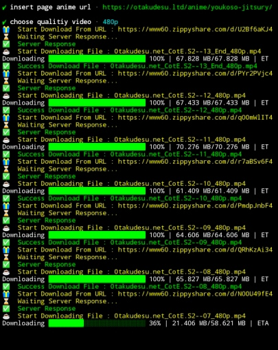

# otaku downloader
alat untuk mengunduh anime dari otakudesu secara otomatis

## bahasa
- indonesian (✓)
  [mode indonesia](https://github.com/fiandev/otaku-downloader/blob/master/ID.README.md)
- english
  [mode Inggris](https://github.com/fiandev/otaku-downloader/blob/master/README.md)

## persiapan

### memasang nodejs

#### menggunakan termux
```
pkg update -y && pkg upgrade -y
pkg install nodejs-lts git -y
```

## instalasi

### install melalui npm

```shell
npm install otaku-downloader -g
```

### mengkopi repository ini

```shell
# mengkopi repositori
git clone https://github.com/fiandev/otaku-downloader

# masuk ke folder repository
cd otaku-downloader

# menginstal modul yang diperlukan
npm install -g
```

## petunjuk penggunaan

### panggil perintah npm yang dapat dieksekusi

```shell
npx otaku
```

## pratinjau


## petunjuk


> dibuat dengan ♥ ️oleh fiandev